# ✈️ Airline-Revenue-Travel-Analytics-Dashboard

The Airline Revenue & Travel Analytics Dashboard was developed to analyze airline performance, route profitability, traveler behavior, and booking channel effectiveness. The dashboard provides insights into revenue drivers,traveler behavior, route performance, and booking channel effectiveness. The dashboard transforms raw booking and travel data into actionable insights that support revenue growth, route optimization, and demand planning decisions.

 </tr>
    <tr>
      <td>🌐</td>
      <td><a href="https://app.powerbi.com/view?r=eyJrIjoiZmZjZGQ0M2QtZGYzZC00ZmMxLTlhOGMtODJhNzhhZTZjOWU5IiwidCI6ImUwYjEzY2QwLTY1MjItNDFmNS05MjFlLTg5OGRmMTBkZGIzMiJ9">View Live Dashboard</a></td>   |      </tr>
    <tr>
      <td>📃</td>
      <td><a href="https://docs.google.com/spreadsheets/d/1_8My4fhZrxE5cDxk_mJd5QfNsZYYzCkS2wV4aE8toX4/edit?usp=drive_link">Dataset</a></td> |    <tr>
      <td>👤</td>
      <td><a href="https://linkedin.com/in/afolakemi-olalekan-145174253">Linkdin Profile</a></td>   |   </tr>
    <tr>
      <td>🌐</td>
      <td><a href="https://olalekan4545.github.io/Port-folio/">Portfolio</a></td>

#  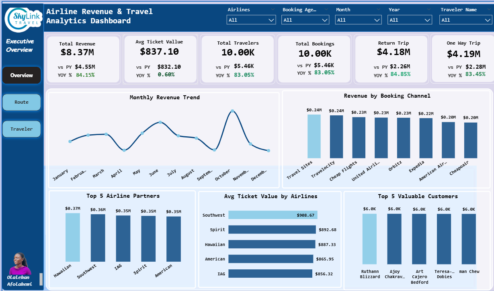

# 
## Table of Contents
- Overview
- Business Objectives
- Dataset Description
- Tools used
- 
- Key Metrics
- Dax Used
- Insights & Recommendations
- How to Use the Report

## 📌 Project Overview
**The Airline Revenue Travel Analytics** is an interactive 3 Pages Power BI dashboard that examines airline operations, traveler behavior, route performance, and booking channel Effectiveness.

<table>
  <tr>
    <th>Dataset Information</th>
    <th>Value</th>
   </tr>
  <tr>
    <td>Source</td>
    <td>Skylink Flight Dataset</td>
  </tr>
  <tr>
    <td>Tool</td>
    <td>Microsoft PowerBi</td>
  </tr>
  <tr>
    <td>Total Records</td>
    <td>10,000</td>
   </tr>
  <tr>
    <td>Date Range</td>
    <td>2018 - 2019</td>
   </tr>
  <tr>
    <td>Missing Values</td>
    <td>None</td>
      </tr>
   </tr>
  <tr>
    <td>Report Pages</td>
    <td>3</td>
      </tr>
      </tr>
  <tr>
    <td>Live Report</td>
     <td><a href="https://app.powerbi.com/view?r=eyJrIjoiZmZjZGQ0M2QtZGYzZC00ZmMxLTlhOGMtODJhNzhhZTZjOWU5IiwidCI6ImUwYjEzY2QwLTY1MjItNDFmNS05MjFlLTg5OGRmMTBkZGIzMiJ9">View Live Dashboard</a></td>
    </tr>
</table>

## 🎯 Business Objectives
The analysis aimed to:
- Which airlines contribute the most revenue and highest average ticket price?
- What routes offer the best combination of demand and profitability?
- How does revenue vary by seat class, travel purpose, and trip type?
- Which booking channels generate the highest revenue and most valuable customers?
- What seasonal patterns exist in flight bookings and revenue by month?
- Which traveler segments are most likely to choose premium cabins or return trips?
- Where are demand-rich routes underperforming in revenue?
- Which airline partners and routes deserve more commercial investment?
- Compare booking partner effectiveness and revenue contribution
- Deliver recommendations for route optimization, revenue growth, and demand planning.

## 📂 Dataset Description
The dataset contains Flight booking transactions with the following information:
- Booking Date
- Booking Agency
- Travel Start Date
- Traveler Details
- Airline
- Seat Class
- Origin and Destination Information
- Number of Stops
- Trip Type (One-Way / Return)
- Travel Purpose
- Ticket Amount

## 🛠️ Tools Used
- Power BI : to create report and Vissualization.
- DAX : for calulation of Metrics.
- Power Query: for cleaning and checking data quality.
- Data Modeling: for creating a relationship between my dataset and date table.

## 📊 Dasboard Structure
#### Page 1 — Executive Overview

The Executive Overview page provides a high-level snapshot of the airline business performance by tracking key revenue, booking, and customer metrics. It enables stakeholders to quickly assess overall business health, growth trends, and major revenue drivers across the reporting period.

#### Purpose of the Page
This page was created to:
- Monitor overall business performance using key KPIs and year-over-year comparisons.
- Track revenue and booking trends over time to identify growth patterns and seasonality.
- Evaluate the contribution of booking channels and airline partners to overall revenue.
- Identify high-value customers and understand customer value distribution.
- Support strategic decision-making through a concise view of the company's commercial performance.
  
#### Key Questions Answered
- Is revenue growing compared to the previous year?
- How are bookings trending over time?
- Which booking channels generate the most revenue?
- Which airline partners contribute the most value?
- Who are the highest-value customers?

#### Key Visuals
The key visuals includes:
- Booking and revenue monthly trend
  
This shows the Monthly revenue generated by the organisation and the monthly Bookings.

 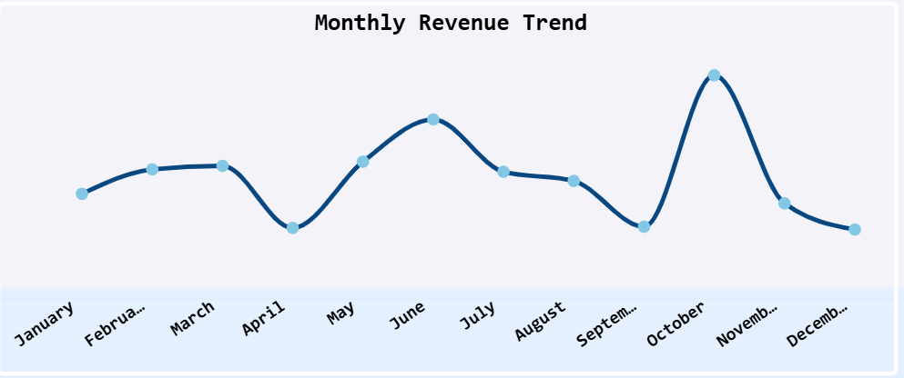

- Revenue by booking channel

 This Visual shows the total revenue generated by each booking channels, whereby **Travel Sites** contributed the highest revenue of **0.24m**.
 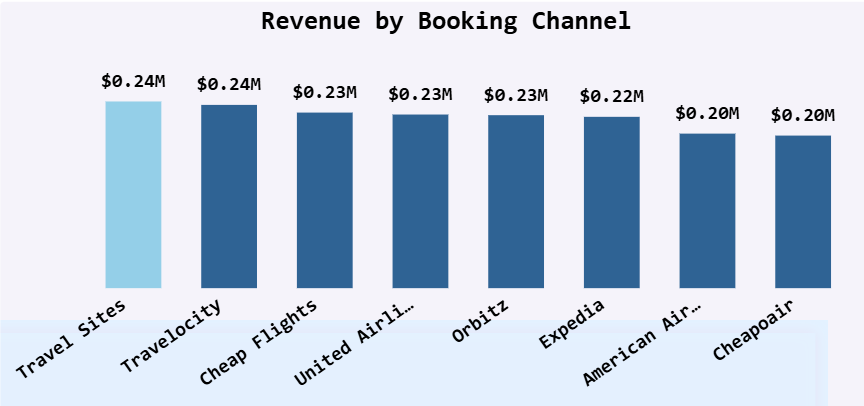

 
- Top 5 airline partners

  This Visual Show the 5 most Profitable Airline Partners, where **Hawaiian leads with **0.37m** Revenue.
  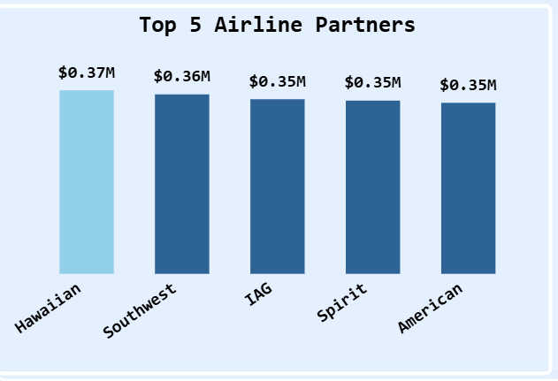

 
  
- Average ticket value

This Visual Present the average amount travelers spend per booking for each airline partner.

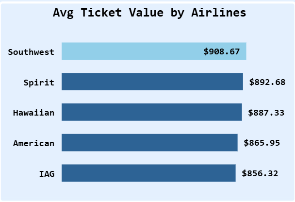

-  Top 5 valuable customers.

It shows the five travelers who generated the highest total revenue for the business through their bookings, where **Ruthann Blizzard** contributed the highest revenue of **6.0k**
  
 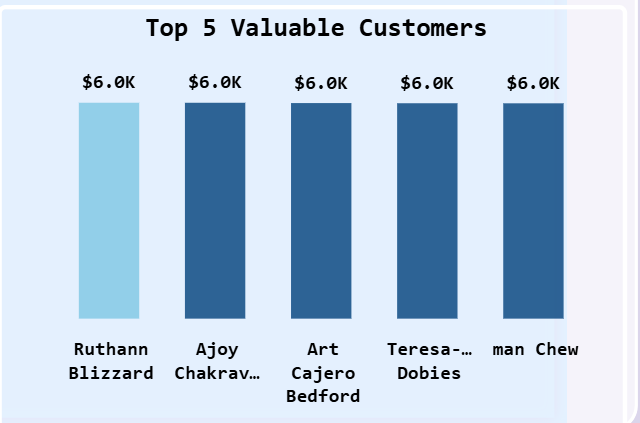

  
This page serves as the executive summary layer of the dashboard, allowing decision-makers to understand the business at a glance before drilling into route performance and traveler behavior on subsequent pages.

#### Page 2: Route & Partner Performance Analysis
The Route & Partner Performance page focuses on identifying the key drivers of revenue across routes, airline partners, destinations, and booking channels. It highlights top-performing and underperforming areas to support commercial decision-making and revenue optimization.

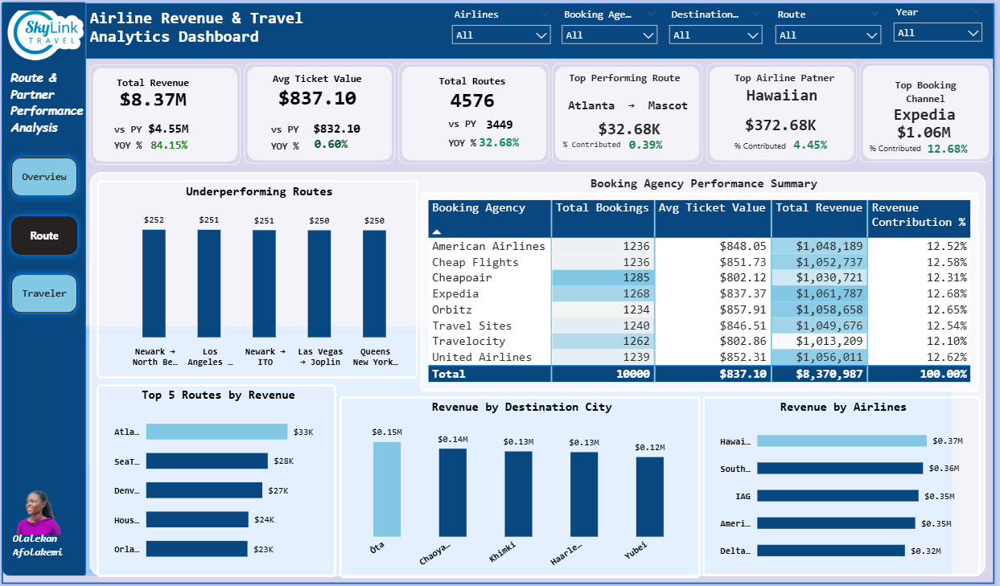

#### Purpose of the Page
This page was created to:
- Evaluate the profitability and performance of travel routes.
- Identify the most valuable destination markets and airline partners.
- Measure the effectiveness of booking agencies in generating revenue and bookings.
- Detect underperforming routes that may require strategic intervention or optimization.
- Support route planning, partnership management, and revenue growth initiatives.
  
#### Key Questions Answered
- Which routes generate the highest revenue?
- Which routes are underperforming?
- Which destination cities contribute the most revenue?
- Which airline partners drive the business?
- Which booking agencies contribute the most bookings and revenue?

#### Key Visuals
- Under forming routes

these are routes that are not contributing enough to the business compared to other routes.

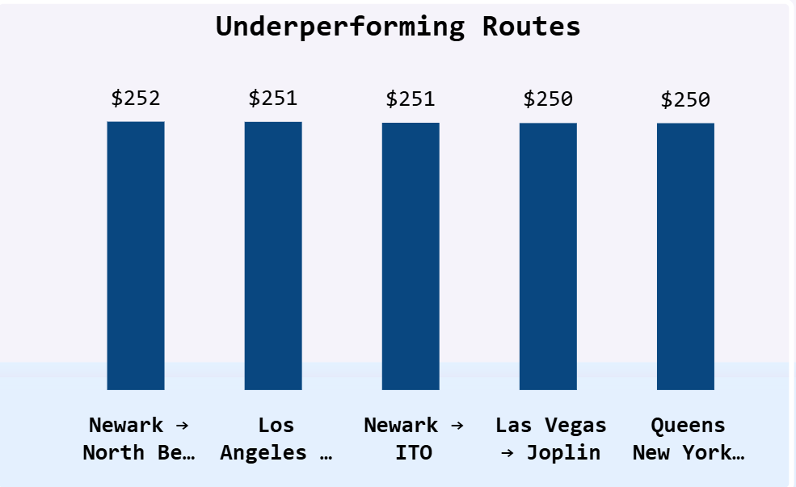

- Top 5 routes by Revenue

 these are top 5 Performing route that contribute enough money to the business where **Atlanta - Mascot route** contribute the highest revenue of **33k** to the business
 
 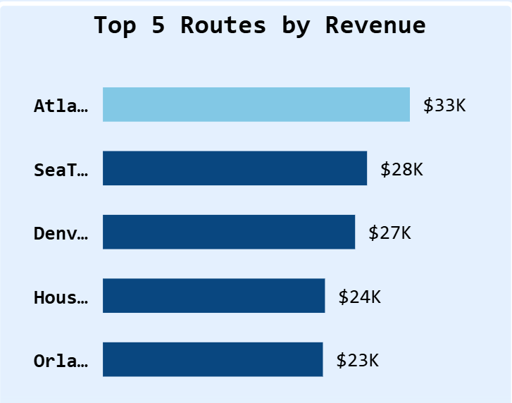

- Revenue by destination city

 This visual showswhich cities are the most valuable destination for the business.**OTA** generated the highest revenue of **0.15m**
 
 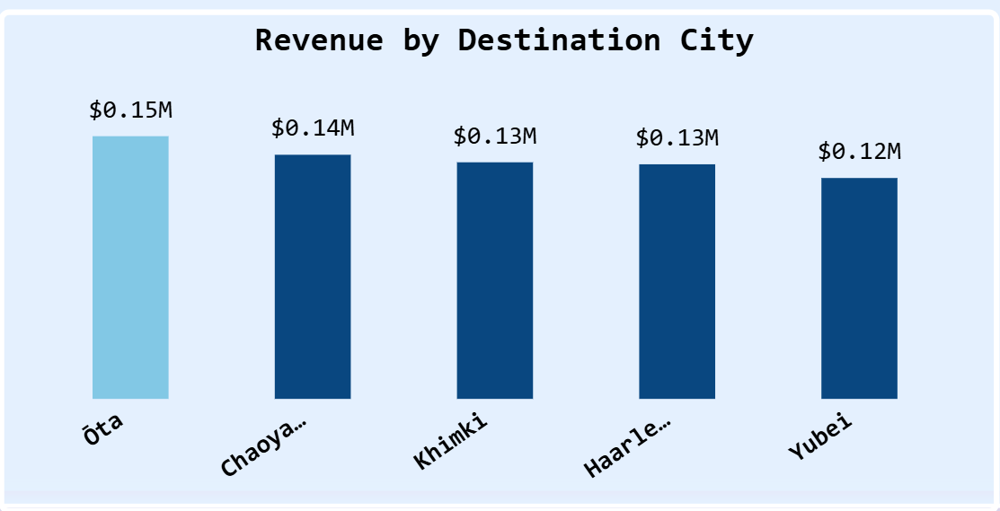
 
-  Booking agency performance table

This visual shows the booking agencies that bring the most customers and generate the most revenue to the business.

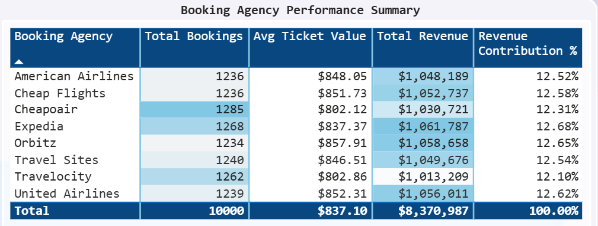

This page serves as the commercial performance layer of the dashboard, helping stakeholders understand where revenue is generated and where opportunities for optimization exist.

#### Page 3: Traveler Behavior & Demand Insights

The Traveler Behavior & Demand Insights page explores customer travel patterns, preferences, and booking behavior. It provides visibility into how different traveler segments contribute to revenue and helps identify the characteristics of high-value customers.
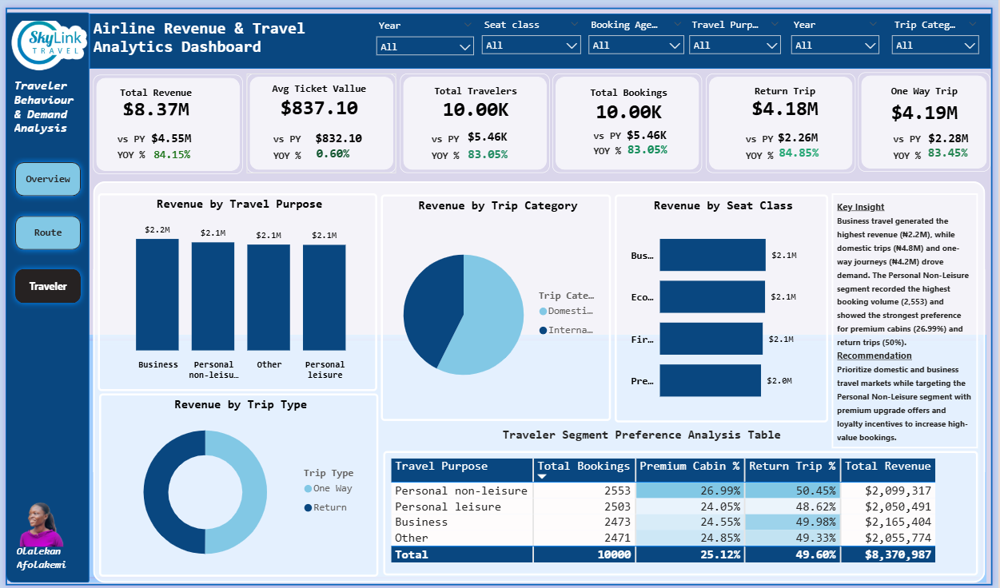

#### Purpose of the Page
This page was created to:
- Understand traveler preferences across trip types, seat classes, and travel purposes.
- Identify the traveler segments that contribute the most revenue and bookings.
- Measure demand patterns between one-way and return travel.
- Analyze premium cabin adoption and return-trip behavior across traveler segments.
- Support customer targeting, pricing strategies, and demand planning initiatives.
  
#### Key Questions Answered
- What travel purpose generates the most revenue?
- Do travelers prefer one-way or return trips?
- Which seat classes contribute the highest revenue?
- Are domestic or international trips driving demand?
- Which traveler segments are most likely to choose premium cabins or return trips?

#### Key Visuals
The visual includes: 
- Revenue by Travel Purpose
  
This visual shows how much revenue is generated by each reason for travelling, **Business** generated the highest revenue of **2.1m** to the busines.

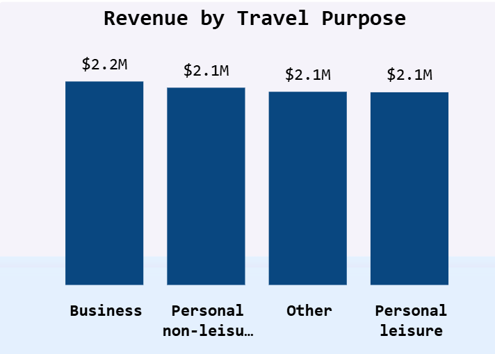

- Revenue by Trip Type

This visual tells us how much revenue is generated by each type of trip, **one-way trip** generated more revenue than return trip.

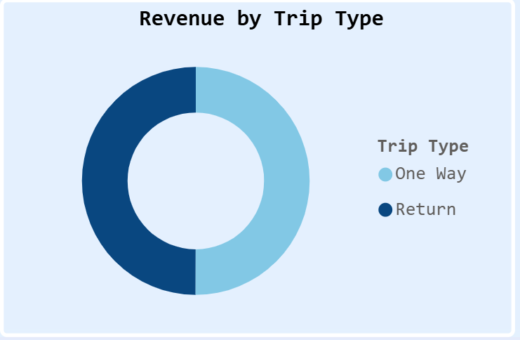

- Revenue by Seat class

This visual show how much revenue is generated by each seat class,generated the highest revenue of **2.2m** to the busines.

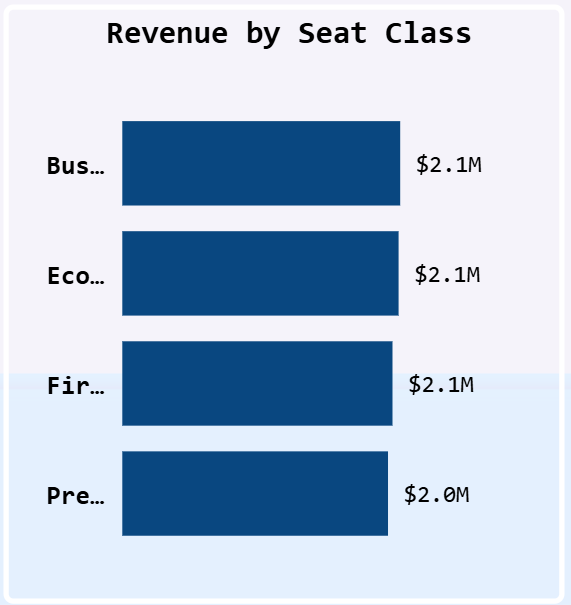
  
- Revenue by Trip category

The visual tells us how much each category contributes to total revenue, **Domestic Trip** generated more revenue than international trip.

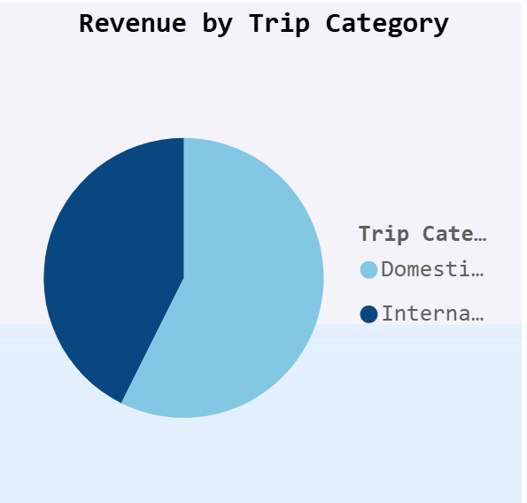

- Travel segment preference analysis

This table visual examine how different groups of travelers behave and what choice they make.

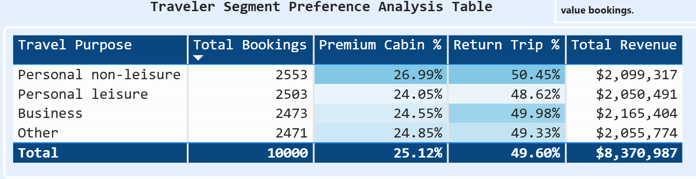

This page serves as the customer and demand intelligence layer of the dashboard, enabling stakeholders to better understand traveler behavior and uncover opportunities for customer growth and premium revenue expansion.
